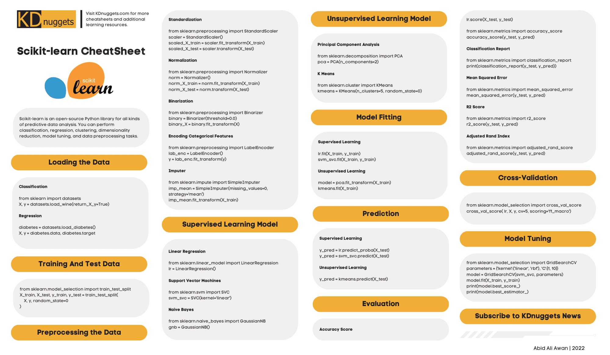

### Contents

| Library         | Subtopics                                   | Library         | Subtopics                                   |
|------------------|---------------------------------------------|------------------|---------------------------------------------|
| [**NumPy**](#numpy)        | - [Array Creation](#1-array-creation)   - [Array Properties](#2-array-properties)   - [Array Manipulation](#3-array-manipulation)   - [Indexing and Slicing](#4-indexing-and-slicing)   - [Mathematical Functions](#5-mathematical-functions)   - [Aggregation Functions](#6-aggregation-functions)   - [Linear Algebra](#7-linear-algebra)   - [Random Number Generation](#8-random-number-generation)   - [File I/O](#9-file-io)   - [Advanced Functions](#10-advanced-functions) | [**Pandas**](#pandas)       | - [Data Structures](#1-data-structures)   - [Creating DataFrames](#2-creating-dataframes)   - [Basic DataFrame Operations](#3-basic-dataframe-operations)   - [Data Selection and Indexing](#4-data-selection-and-indexing)   - [Data Cleaning](#5-data-cleaning)   - [Data Manipulation](#6-data-manipulation)   - [Time Series](#7-time-series)   - [Input/Output](#8-inputoutput)   - [Visualization](#9-visualization)   - [Advanced Features](#10-advanced-features) |
| [**Matplotlib**](#matplotlib)   | - [Basic Plotting](#1-basic-plotting)   - [Customization](#2-customization)   - [Subplots](#3-subplots)   - [Axes and Ticks](#4-axes-and-ticks)   - [Legends and Annotations](#5-legends-and-annotations)   - [Saving Figures](#6-saving-figures)   - [Plot Types](#7-plot-types)   - [Interactive Plots](#8-interactive-plots)   - [3D Plotting](#9-3d-plotting)   - [Advanced Features](#10-advanced) | [**Scikit-learn**](#scikit-learn) | - [Data Preprocessing](#1-data-preprocessing)   - [Feature Selection](#2-feature-selection)   - [Model Selection](#3-model-selection)   - [Classification](#4-classification)   - [Regression](#5-regression)   - [Clustering](#6-clustering)   - [Dimensionality Reduction](#7-dimensionality-reduction)   - [Model Evaluation](#8-model-evaluation)   - [Pipelines](#9-pipelines)   - [Ensemble Methods](#10-ensemble-methods) |

## NumPy

### 1. Array Creation

| Function                    | Description                                   | Example Usage                                 |
|-----------------------------|-----------------------------------------------|-----------------------------------------------|
| `np.array()`                | Create an array from a list or tuple.       | `np.array([1, 2, 3])`                          |
| `np.zeros(shape)`           | Create an array filled with zeros.           | `np.zeros((2, 3))`                             |
| `np.ones(shape)`            | Create an array filled with ones.            | `np.ones((3, 3))`                              |
| `np.empty(shape)`           | Create an empty array (uninitialized).       | `np.empty((2, 2))`                             |
| `np.arange(start, stop, step)` | Create an array with a range of values. | `np.arange(0, 10, 2)`                          |
| `np.linspace(start, stop, num)` | Create an array with evenly spaced values. | `np.linspace(0, 1, 5)`                          |
| `np.eye(N)`                 | Create a 2D identity matrix of size N.      | `np.eye(3)`                                   |

### 2. Array Properties

| Attribute                   | Description                                   | Example Usage                                 |
|-----------------------------|-----------------------------------------------|-----------------------------------------------|
| `ndarray.shape`             | Get the shape of an array.                   | `array.shape`                                 |
| `ndarray.ndim`              | Get the number of dimensions of an array.    | `array.ndim`                                  |
| `ndarray.size`              | Get the total number of elements in an array.| `array.size`                                  |
| `ndarray.dtype`             | Get the data type of the elements in an array.| `array.dtype`                                 |
| `ndarray.itemsize`          | Get the size (in bytes) of each element.     | `array.itemsize`                              |

### 3. Array Manipulation

| Function                    | Description                                   | Example Usage                                 |
|-----------------------------|-----------------------------------------------|-----------------------------------------------|
| `ndarray.reshape(shape)`    | Change the shape of an array without changing its data. | `array.reshape((2, 3))`                   |
| `ndarray.flatten()`         | Flatten a multi-dimensional array into a 1D array. | `array.flatten()`                          |
| `np.concatenate((a1, a2), axis)` | Join two or more arrays along an existing axis. | `np.concatenate((array1, array2), axis=0)` |
| `np.vstack((a1, a2))`      | Stack arrays in sequence vertically (row-wise). | `np.vstack((array1, array2))`               |
| `np.hstack((a1, a2))`      | Stack arrays in sequence horizontally (column-wise). | `np.hstack((array1, array2))`               |
| `ndarray.transpose()`       | Transpose the array (swap rows and columns). | `array.transpose()`                          |
| `np.split(array, indices)` | Split an array into multiple sub-arrays.     | `np.split(array, [2, 4])`                    |

### 4. Indexing and Slicing

| Function                    | Description                                   | Example Usage                                 |
|-----------------------------|-----------------------------------------------|-----------------------------------------------|
| `ndarray[index]`            | Access elements of an array.                  | `array[0]`                                   |
| `ndarray[start:stop:step]` | Slice an array.                               | `array[1:5:2]`                               |
| `ndarray[:, index]`        | Select a specific column in a 2D array.      | `array[:, 1]`                                |
| `ndarray[mask]`            | Boolean indexing.                             | `array[array > 5]`                           |

### 5. Mathematical Functions

| Function                    | Description                                   | Example Usage                                 |
|-----------------------------|-----------------------------------------------|-----------------------------------------------|
| `np.add(a, b)`             | Element-wise addition.                       | `np.add(array1, array2)`                      |
| `np.subtract(a, b)`        | Element-wise subtraction.                    | `np.subtract(array1, array2)`                 |
| `np.multiply(a, b)`        | Element-wise multiplication.                 | `np.multiply(array1, array2)`                 |
| `np.divide(a, b)`          | Element-wise division.                       | `np.divide(array1, array2)`                   |
| `np.sqrt(x)`               | Square root.                                 | `np.sqrt(array)`                              |
| `np.exp(x)`                | Exponential function.                        | `np.exp(array)`                               |
| `np.log(x)`                | Natural logarithm.                           | `np.log(array)`                               |
| `np.sin(x)`, `np.cos(x)`, `np.tan(x)` | Trigonometric functions.         | `np.sin(array)`                               |
| `np.mean(x)`, `np.median(x)`, `np.std(x)`, `np.var(x)` | Statistical functions. | `np.mean(array)`                              |

### 6. Aggregation Functions

| Function                    | Description                                   | Example Usage                                 |
|-----------------------------|-----------------------------------------------|-----------------------------------------------|
| `np.sum(array, axis)`      | Sum of array elements over a given axis.    | `np.sum(array, axis=0)`                       |
| `np.prod(array, axis)`     | Product of array elements over a given axis.| `np.prod(array, axis=1)`                      |
| `np.min(array, axis)`      | Minimum value along an axis.                 | `np.min(array, axis=0)`                       |
| `np.max(array, axis)`      | Maximum value along an axis.                 | `np.max(array, axis=1)`                       |
| `np.argmin(array, axis)`   | Index of the minimum value along an axis.    | `np.argmin(array, axis=0)`                    |
| `np.argmax(array, axis)`   | Index of the maximum value along an axis.    | `np.argmax(array, axis=1)`                    |

### 7. Linear Algebra

| Function                    | Description                                   | Example Usage                                 |
|-----------------------------|-----------------------------------------------|-----------------------------------------------|
| `np.dot(a, b)`             | Dot product of two arrays.                   | `np.dot(array1, array2)`                      |
| `np.matmul(a, b)`          | Matrix product of two arrays.                | `np.matmul(array1, array2)`                   |
| `np.linalg.inv(x)`         | Compute the inverse of a matrix.             | `np.linalg.inv(matrix)`                       |
| `np.linalg.det(x)`         | Compute the determinant of a matrix.         | `np.linalg.det(matrix)`                       |
| `np.linalg.eig(x)`         | Compute the eigenvalues and right eigenvectors of a square array. | `np.linalg.eig(matrix)`              |

### 8. Random Number Generation

| Function                    | Description                                   | Example Usage                                 |
|-----------------------------|-----------------------------------------------|-----------------------------------------------|
| `np.random.rand(d0, d1, ..., dn)` | Generate random numbers from a uniform distribution. | `np.random.rand(3, 3)`                   |
| `np.random.randn(d0, d1, ..., dn)` | Generate random numbers from a standard normal distribution. | `np.random.randn(2, 2)`              |
| `np.random.randint(low, high, size)` | Generate random integers from low (inclusive) to high (exclusive). | `np.random.randint(0, 10, (2, 2))` |
| `np.random.choice(a, size)` | Generate a random sample from a given array. | `np.random.choice(array, size=3)`         |

### 9. File I/O

| Function                    | Description                                   | Example Usage                                 |
|-----------------------------|-----------------------------------------------|-----------------------------------------------|
| `np.save(file, array)`     | Save an array to a binary file in .npy format. | `np.save('array.npy', array)`              |
| `np.load(file)`            | Load an array from a .npy file.              | `np.load('array.npy')`                       |
| `np.savetxt(file, array)`  | Save an array to a text file.                | `np.savetxt('array.txt', array)`             |
| `np.loadtxt(file)`         | Load data from a text file.                  | `np.loadtxt('array.txt')`                    |

### 10. Advanced Functions

| Function                    | Description                                   | Example Usage                                 |
|-----------------------------|-----------------------------------------------|-----------------------------------------------|
| `np.where(condition, x, y)` | Return elements from `x` or `y` based on `condition`. | `np.where(array > 5, array, 0)`         |
| `np.unique(array)`         | Find the unique elements of an array.        | `np.unique(array)`                            |
| `np.meshgrid(x, y)`       | Create coordinate matrices from coordinate vectors. | `np.meshgrid(x, y)`                        |

## Pandas

### 1. Data Structures

| Data Structure         | Description                                   | Example Usage                                 |
|------------------------|-----------------------------------------------|-----------------------------------------------|
| `pd.Series`            | 1D labeled array capable of holding any data type. | `pd.Series([1, 2, 3])`                   |
| `pd.DataFrame`         | 2D labeled data structure with columns of potentially different types. | `pd.DataFrame({'A': [1, 2, 3], 'B': [4, 5, 6]})` |
| `pd.Panel`             | 3D labeled data structure (less commonly used). | `pd.Panel(data)`               |

### 2. Creating DataFrames

| Function                    | Description                                   | Example Usage                                 |
|-----------------------------|-----------------------------------------------|-----------------------------------------------|
| `pd.DataFrame(data)`        | Create a DataFrame from a dictionary, list, or array. | `pd.DataFrame({'A': [1, 2, 3], 'B': [4, 5, 6]})` |
| `pd.read_csv(filepath)`     | Read a CSV file into a DataFrame.            | `pd.read_csv('data.csv')` |
| `pd.read_excel(filepath)`   | Read an Excel file into a DataFrame.         | `pd.read_excel('data.xlsx')` |
| `pd.read_json(filepath)`    | Read a JSON file into a DataFrame.           | `pd.read_json('data.json')` |
| `pd.read_sql(query, con)`   | Read SQL query results into a DataFrame.     | `pd.read_sql('SELECT * FROM table', connection)` |

### 3. Basic DataFrame Operations

| Function                    | Description                                   | Example Usage                                 |
|-----------------------------|-----------------------------------------------|-----------------------------------------------|
| `df.head(n)`               | Return the first n rows of the DataFrame.    | `df.head(5)` |
| `df.tail(n)`               | Return the last n rows of the DataFrame.     | `df.tail(5)` |
| `df.shape`                 | Get the dimensions of the DataFrame.         | `df.shape` |
| `df.columns`               | Get the column labels of the DataFrame.      | `df.columns` |
| `df.index`                 | Get the index labels of the DataFrame.       | `df.index` |
| `df.info()`                | Get a concise summary of the DataFrame.      | `df.info()` |
| `df.describe()`            | Generate descriptive statistics for numeric columns. | `df.describe()` |

### 4. Data Selection and Indexing

| Function                    | Description                                   | Example Usage                                 |
|-----------------------------|-----------------------------------------------|-----------------------------------------------|
| `df.loc[]`                  | Access a group of rows and columns by labels. | `df.loc[2:5, 'column']` |
| `df.iloc[]`                 | Access a group of rows and columns by integer positions. | `df.iloc[2:5, 0:3]` |
| `df.at[]`                   | Access a single value for a row/column label pair. | `df.at[2, 'column']` |
| `df.iat[]`                  | Access a single value for a row/column pair by integer position. | `df.iat[2, 3]` |
| `df[df['column'] > value]`  | Filter DataFrame based on conditions.       | `df[df['age'] > 18]` |

### 5. Data Cleaning

| Function                    | Description                                   | Example Usage                                 |
|-----------------------------|-----------------------------------------------|-----------------------------------------------|
| `df.dropna()`               | Remove missing values.                       | `df.dropna()` |
| `df.fillna(value)`          | Fill missing values with a specified value.  | `df.fillna(0)` |
| `df.replace(to_replace, value)` | Replace values in the DataFrame.         | `df.replace('unknown', 'N/A')` |
| `df.duplicated()`           | Check for duplicate rows.                     | `df.duplicated()` |
| `df.drop_duplicates()`      | Remove duplicate rows from the DataFrame.    | `df.drop_duplicates()` |

### 6. Data Manipulation

| Function                    | Description                                   | Example Usage                                 |
|-----------------------------|-----------------------------------------------|-----------------------------------------------|
| `df.sort_values(by)`        | Sort DataFrame by one or more columns.       | `df.sort_values('column')` |
| `df.groupby(by)`            | Group data by one or more columns.           | `df.groupby('column').sum()` |
| `df.aggregate(func)`        | Apply an aggregation function to grouped data.| `df.groupby('column').aggregate({'column2': 'sum', 'column3': 'mean'})` |
| `df.apply(func)`            | Apply a function along an axis of the DataFrame. | `df.apply(lambda x: x.max() - x.min())` |
| `df.merge(right, how, on)`  | Merge two DataFrames based on a key.        | `df.merge(df2, how='inner', on='key')` |
| `df.concat(objs)`           | Concatenate two or more DataFrames.          | `df.concat([df1, df2, df3])` |
| `df.pivot(index, columns, values)` | Reshape data based on column values.  | `df.pivot('index', 'columns', 'values')` |

### 7. Time Series

| Function                    | Description                                   | Example Usage                                 |
|-----------------------------|-----------------------------------------------|-----------------------------------------------|
| `pd.to_datetime(arg)`       | Convert argument to datetime.                 | `pd.to_datetime('2022-01-01')` |
| `df.resample(rule)`         | Resample time series data.                   | `df.resample('D').sum()` |
| `df.shift(periods)`         | Shift index by desired number of periods.    | `df.shift(1)` |
| `df.asfreq(freq)`           | Convert to specified frequency.               | `df.asfreq('M')` |

### 8. Input/Output

| Function                    | Description                                   | Example Usage                                 |
|-----------------------------|-----------------------------------------------|-----------------------------------------------|
| `df.to_csv(filepath)`       | Write DataFrame to a CSV file.               | `df.to_csv('data.csv')` |
| `df.to_excel(filepath)`     | Write DataFrame to an Excel file.            | `df.to_excel('data.xlsx')` |
| `df.to_json(filepath)`      | Write DataFrame to a JSON file.              | `df.to_json('data.json')` |
| `df.to_sql(name, con)`      | Write DataFrame to a SQL database.           | `df.to_sql('table', connection)` |

### 9. Visualization

| Function                    | Description                                   | Example Usage                                 |
|-----------------------------|-----------------------------------------------|-----------------------------------------------|
| `df.plot()`                 | Basic plotting method for DataFrame.         | `df.plot()` |
| `df.hist()`                 | Plot histograms for each numerical column.   | `df.hist()` |
| `df.boxplot()`              | Create box plots for numerical columns.       | `df.boxplot()` |

### 10. Advanced Features

| Function                    | Description                                   | Example Usage                                 |
|-----------------------------|-----------------------------------------------|-----------------------------------------------|
| `pd.get_dummies(df)`        | Convert categorical variable into dummy/indicator variables. | `pd.get_dummies(df)` |
| `pd.cut(x, bins)`           | Bin values into discrete intervals.          | `pd.cut(df['column'], bins=[0, 10, 20, 30])` |
| `pd.qcut(x, q)`             | Quantile-based discretization.               | `pd.qcut(df['column'], q=4)` |

## Matplotlib

### 1. Basic Plotting

| Function                    | Description                                   |
|-----------------------------|-----------------------------------------------|
| `plt.plot(x, y)`           | Create a line plot of y versus x.            |
| `plt.scatter(x, y)`        | Create a scatter plot of y versus x.         |
| `plt.bar(x, height)`       | Create a bar chart with specified heights.    |
| `plt.hist(x, bins)`        | Create a histogram of the data.              |
| `plt.pie(x)`               | Create a pie chart.                           |
| `plt.show()`               | Display the current figure.                   |

### 2. Customization

| Function                    | Description                                   |
|-----------------------------|-----------------------------------------------|
| `plt.title('Title')`       | Set the title of the plot.                   |
| `plt.xlabel('X-axis label')`| Set the label for the x-axis.               |
| `plt.ylabel('Y-axis label')`| Set the label for the y-axis.               |
| `plt.xlim(left, right)`    | Set the limits of the x-axis.               |
| `plt.ylim(bottom, top)`     | Set the limits of the y-axis.               |
| `plt.grid(True)`           | Show grid lines on the plot.                 |
| `plt.legend()`             | Display a legend on the plot.                |

### 3. Subplots

| Function                    | Description                                   |
|-----------------------------|-----------------------------------------------|
| `plt.subplot(nrows, ncols, index)` | Create a subplot in a grid of subplots. |
| `plt.subplots(nrows, ncols)` | Create a figure and an array of subplots.  |
| `plt.tight_layout()`        | Automatically adjust subplot parameters for better layout. |

### 4. Axes and Ticks

| Function                    | Description                                   |
|-----------------------------|-----------------------------------------------|
| `plt.xticks(ticks, labels)` | Specify tick positions and labels on the x-axis. |
| `plt.yticks(ticks, labels)` | Specify tick positions and labels on the y-axis. |
| `plt.axis('equal')`        | Set equal scaling on both axes.              |
| `plt.axis('off')`          | Hide the axis.                               |

### 5. Legends and Annotations

| Function                    | Description                                   |
|-----------------------------|-----------------------------------------------|
| `plt.annotate('Text', xy, xytext)` | Add an annotation to the plot.        |
| `plt.text(x, y, 'Text')`   | Add text at a specific location.             |
| `plt.axhline(y)`           | Draw a horizontal line across the plot.      |
| `plt.axvline(x)`           | Draw a vertical line across the plot.        |

### 6. Saving Figures

| Function                    | Description                                   |
|-----------------------------|-----------------------------------------------|
| `plt.savefig('filename.png')` | Save the current figure to a file.        |
| `plt.savefig('filename.pdf')` | Save the current figure as a PDF.         |

### 7. Plot Types

| Function                    | Description                                   |
|-----------------------------|-----------------------------------------------|
| `plt.barh(y, width)`       | Create a horizontal bar chart.               |
| `plt.boxplot(data)`        | Create a box plot for the given data.       |
| `plt.violinplot(data)`     | Create a violin plot for the given data.    |
| `plt.errorbar(x, y, yerr)` | Plot with error bars.                       |

### 8. Interactive Plots

| Function                    | Description                                   |
|-----------------------------|-----------------------------------------------|
| `plt.ion()`                | Turn on interactive mode.                     |
| `plt.pause(interval)`      | Pause the plot for a given interval.         |
| `plt.clf()`                | Clear the current figure.                     |

### 9. 3D Plotting

| Function                    | Description                                   |
|-----------------------------|-----------------------------------------------|
| `from mpl_toolkits.mplot3d import Axes3D` | Import the 3D plotting toolkit.  |
| `ax = plt.axes(projection='3d')` | Create a 3D axis.                |
| `ax.plot3D(x, y, z)`       | Create a 3D line plot.                      |
| `ax.scatter3D(x, y, z)`    | Create a 3D scatter plot.                   |
| `ax.set_xlabel('X-axis')`  | Set the label for the x-axis in 3D.        |
| `ax.set_ylabel('Y-axis')`  | Set the label for the y-axis in 3D.        |
| `ax.set_zlabel('Z-axis')`  | Set the label for the z-axis in 3D.        |

### 10. Advanced

| Function                    | Description                                   |
|-----------------------------|-----------------------------------------------|
| `plt.subplot2grid(shape, loc)` | Create a subplot in a grid with a specific location. |
| `plt.hist2d(x, y)`         | Create a 2D histogram.                        |
| `plt.imshow(data)`         | Display data as an image (matrix).           |
| `plt.colorbar()`           | Add a color bar to the plot.                 |
| `plt.contour(x, y, z)`    | Draw contour lines.                           |
| `plt.fill_between(x, y1, y2)` | Fill the area between two curves.        |

## Scikit-learn

### 1. Data Preprocessing

| Function                            | Description                                   |
|-------------------------------------|-----------------------------------------------|
| `StandardScaler()`                  | Standardize features by removing the mean and scaling to unit variance. |
| `MinMaxScaler()`                    | Scale features to a given range (default: [0, 1]). |
| `OneHotEncoder()`                   | Convert categorical variable(s) into dummy/indicator variables. |
| `LabelEncoder()`                    | Encode target labels with value between 0 and n_classes-1. |
| `train_test_split(X, y)`           | Split arrays or matrices into random train and test subsets. |
| `SimpleImputer(strategy='mean')`   | Impute missing values with the mean, median, or constant. |

### 2. Feature Selection

| Function                            | Description                                   |
|-------------------------------------|-----------------------------------------------|
| `SelectKBest(score_func, k)`       | Select the top k features based on univariate statistical tests. |
| `RFE(estimator, n_features_to_select)` | Recursive feature elimination.          |
| `VarianceThreshold(threshold=0)`    | Remove features with low variance.           |

### 3. Model Selection

| Function                            | Description                                   |
|-------------------------------------|-----------------------------------------------|
| `GridSearchCV(estimator, param_grid)` | Exhaustive search over specified parameter values for an estimator. |
| `RandomizedSearchCV(estimator, param_distributions)` | Randomized search on hyperparameters.   |
| `cross_val_score(estimator, X, y)` | Evaluate a score by cross-validation.       |
| `KFold(n_splits)`                  | K-Folds cross-validator.                     |

### 4. Classification

| Function                            | Description                                   |
|-------------------------------------|-----------------------------------------------|
| `LogisticRegression()`               | Logistic regression classifier.              |
| `DecisionTreeClassifier()`           | Decision tree classifier.                    |
| `RandomForestClassifier()`           | Random forest classifier.                    |
| `SVC(kernel='linear')`              | Support Vector Classification.               |
| `KNeighborsClassifier(n_neighbors)`  | K-Nearest Neighbors classifier.              |

### 5. Regression

| Function                            | Description                                   |
|-------------------------------------|-----------------------------------------------|
| `LinearRegression()`                | Ordinary least squares Linear Regression.    |
| `Ridge(alpha)`                      | Ridge regression (L2 regularization).        |
| `Lasso(alpha)`                      | Lasso regression (L1 regularization).        |
| `RandomForestRegressor()`          | Random forest regressor.                     |
| `SVR(kernel='linear')`             | Support Vector Regression.                   |

### 6. Clustering

| Function                            | Description                                   |
|-------------------------------------|-----------------------------------------------|
| `KMeans(n_clusters)`                | K-Means clustering algorithm.                 |
| `DBSCAN(eps, min_samples)`          | Density-based spatial clustering of applications with noise. |
| `AgglomerativeClustering()`         | Agglomerative hierarchical clustering.       |

### 7. Dimensionality Reduction

| Function                            | Description                                   |
|-------------------------------------|-----------------------------------------------|
| `PCA(n_components)`                 | Principal Component Analysis.                 |
| `tSNE(n_components)`                | t-distributed Stochastic Neighbor Embedding. |
| `IncrementalPCA(n_components)`      | Incremental PCA for large datasets.          |

### 8. Model Evaluation

| Function                            | Description                                   |
|-------------------------------------|-----------------------------------------------|
| `accuracy_score(y_true, y_pred)`   | Compute the accuracy.                        |
| `confusion_matrix(y_true, y_pred)` | Compute confusion matrix.                    |
| `classification_report(y_true, y_pred)` | Build a text report showing the main classification metrics. |
| `mean_squared_error(y_true, y_pred)` | Compute the mean squared error regression loss. |

### 9. Pipelines

| Function                            | Description                                   |
|-------------------------------------|-----------------------------------------------|
| `Pipeline(steps)`                   | Create a pipeline for sequentially applying a list of transforms and a final estimator. |
| `make_pipeline(*steps)`             | Create a pipeline with automatically named steps. |

### 10. Ensemble Methods

| Function                            | Description                                   |
|-------------------------------------|-----------------------------------------------|
| `BaggingClassifier(base_estimator)` | Ensemble method using bagging.               |
| `AdaBoostClassifier(base_estimator)` | Adaptive Boosting classifier.                |
| `GradientBoostingClassifier()`      | Gradient Boosting classifier.                 |
| `VotingClassifier(estimators)`       | Voting classifier for combining multiple models. |

---

