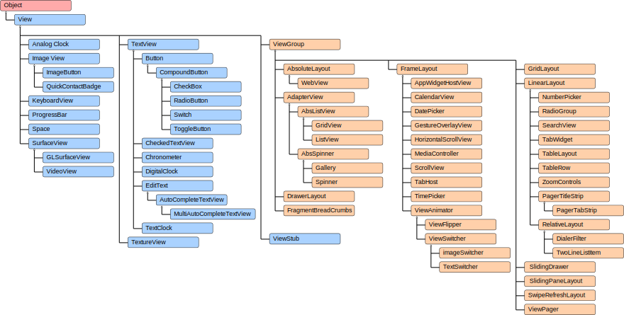
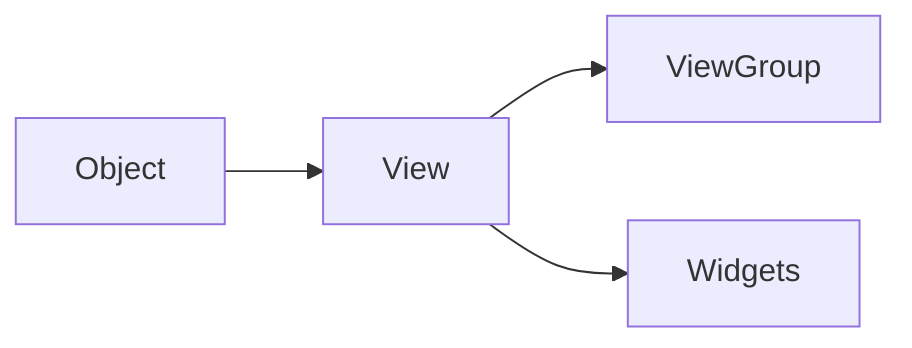

# Mobile Application Development Lab

Android Studio is the official IDE for Android OS, based on *JetBrains IntelliJ IDEA* software.
It provides a comprehensive suite of tools to help developers create, test and debug Android applications.

Android Studio uses *Gradle* to manage the build process, packaging APKs etc.

## 1. Getting Started

**Android Studio** can be downloaded from the [official page](https://developer.android.com/studio/#downloads).

To create a new project, run *File -> New -> New Project*.
Now select a project template (e.g., *Empty Views Activity*), configure the project by providing a name, save location etc. and click Finish.

> Create a new virtual device to run the app on by *Device Manager -> + -> Create Virtual Device*  

Click **Run 'app' (Shift + F10)** to run on the emulator or smartphone connected via WiFi or USB.

> If Gradle Build fails, make sure `compileSdk` and `targetSdk` is set to `34` on *Gradle Scripts -> build.gradle.kts*

#### Project Structure

```
app
    ├── manifests
    │   └── AndroidManifest.xml
    ├── java
    │   └── com.example.myapplication
    │       └── MainActivity.java
    └── res
        ├── drawable
        ├── layout
        │   └── activity_main.xml
        ├── mipmap
        ├── values
        └── xml
Gradle Scripts
```

`app` is the main module of the application.
Metadata, permissions, etc. is contained in the `AdroidManifest.xml` in the `manifests` folder.
`java` folder contains the Java / Kotlin source code. 
All the non-code resources are located in the `res` folder, such as layouts (`layout`), images (`drawable`), icons (`mipmap`), strings (`values`), **XML** etc.
`Gradle Scripts` define how the project is built and managed.

The `xml` could be considered as the frontend and the `java` file as the backend of our application.

#### Widgets and Layouts

Widgets are the basic building blocks of an Android application's UI. 
They are interactive components that users can interact with. 
Common Widgets include:

- **Button**
- **TextView**: Displays text.
- **EditText**: Text input field.
- **ImageView**: Displays an image.
- **CheckBox**
- **RadioButton**
- **ProgressBar**

Layouts are containers that define the structure for a UI in an app. They hold widgets and other layouts, arranging them on the screen according to specific rules.
Common Layouts include:

- **LinearLayout**: Arranges its children in a single row or column.
- **RelativeLayout**: Arranges its children in relation to each other or to the parent container.
- **ConstraintLayout**: A flexible layout that allows you to position and size widgets.
- **FrameLayout**: A simple layout that can hold one child view, making it useful for displaying a single item.
- **GridLayout**: Arranges its children in a grid.



Layouts are a type of ViewGroup.
**ViewGroup** is a subclass of View that can contain other Views. 
It acts as a container for other views.
**View** is the simplest UI component in Android. Widgets are a specific type of View.


Class Hierarchy in Java:


<!-- ## 2. Layouts -->

<!-- ## 3. Activity -->

---

References:
- [CodeWithHarry's Course](https://www.youtube.com/playlist?list=PLu0W_9lII9aiL0kysYlfSOUgY5rNlOhUd)
- [Geeks For Geeks](https://www.geeksforgeeks.org/android-studio-tutorial/)